# **Sistema IoT para Detección de Incendios en los Cerros Orientales de Bogotá**

## Miembros: Samuel Rodriguez, Valentina Ruiz Torres y Darek Aljuri Martínez

## 1. Introducción
### 1.1 Resumen General
El presente documento describe el desarrollo de un sistema IoT para la detección temprana de incendios en los cerros orientales de Bogotá. Se detallan las etapas de diseño, desarrollo, implementación y validación de la solución, asegurando que el prototipo sea funcional y eficiente en la identificación de riesgos de incendio mediante sensores de temperatura, gas y llama. La solución utiliza un microcontrolador ESP-32 junto con una pantalla LCD, un buzzer y un led rgb para proporcionar alertas locales, asi como un “Tablero de control” en un servidor web embebido proporcionado por el microcontrolador conectado a la WLAN ofrecida por la alcaldía, donde tambien se podra visualizar el valor actual y un histórico reciente de las variables físicas de interés, así como recibir notificaciones de cualquier eventualidad y desactivar alarmas físicas.

### 1.2 Motivación
Los cerros orientales de Bogotá son una zona ecológica de gran importancia, pero altamente susceptible a incendios forestales debido a la sequía y actividad humana. La detección temprana de incendios es clave para minimizar daños ambientales y proteger comunidades cercanas. Para ello, se requiere un sistema de monitoreo en tiempo real que permita detectar cambios bruscos en temperatura, presencia de humo y emisión de gases característicos de la combustión. Además, es fundamental contar con una plataforma que no solo permita visualizar el historial de datos y activar alarmas físicas de manera remota, sino que también genere alertas automáticas en caso de riesgo inminente de incendio, facilitando una respuesta rápida y efectiva.


### 1.3 Justificación
El desarrollo de este sistema surge de la necesidad de implementar una solución de bajo costo y fácil instalación para la detección temprana de incendios forestales en zonas vulnerables. Utilizando sensores especializados, el sistema detecta la presencia de gases y anomalías en la temperatura, proporcionando información en tiempo real para la toma de decisiones. Además, cuenta con alarmas in situ y envía los datos recopilados a una página web embebida, facilitando el monitoreo y la respuesta rápida ante posibles incendios.

### 1.4 Estructura de la Documentación

Este documento se divide en las siguientes secciones:

1. **Solución propuesta**: Restricciones, arquitectura, desarrollo teórico y estándares aplicados.
2. **Configuración experimental y resultados**: Validación del sistema en condiciones controladas.
3. **Autoevaluación del protocolo de pruebas**: Verificación de confiabilidad y precisión.
4. **Conclusiones y trabajo futuro**: Desafíos enfrentados y mejoras futuras.
5. **Anexos**: Código fuente, esquemáticos y documentación adicional.

## 2. Solución Propuesta
### 2.1 Restricciones de Diseño

***Técnicas***
- Uso de un ESP32 como microcontrolador central. Este dispositivo, además de ser de código abierto, incorpora un microcontrolador reprogramable con conectividad Wi-Fi y Bluetooth, así como múltiples pines de entrada y salida analógicos y digitales. Esto permite la conexión eficiente con sensores y actuadores. "El ESP32 destaca por su alto rendimiento gracias a su procesador de doble núcleo. Puede llegar hasta 240 MHz, manejando tareas complejas y procesamiento en tiempo real. Esto es clave para proyectos IoT avanzados que necesitan manejar varios procesos a la vez" [1]
- Sensor de temperatura DS18B20, "permite medir la temperatura a través de un termistor NTC, un comparador LM393, y un potenciometro"[2], esto le permite al sensor adecuar una señal de trabajo operable digital.
- Sensor de gas (MQ-2), "Este sensor es adecuado para detectar GLP, I-butano, propano, metano, alcohol, hidrógeno y humo. Tiene alta sensibilidad y respuesta rápida"[3], ademas de esto cuenta con un potenciometrp para ajustar la sensibilidad.
- Sensor de Llama (KY-026). "Consta de un LED receptor de infrarrojos de 5 mm, un comparador diferencial dual LM393, un potenciómetro de recorte de 3296 W, 6 resistencias, y 4 pines de cabezal macho"[4] Es decir que detecta la luz infrarroja emitida por el fuego, y debido a su potenciometro se puede ajustar su sensibilidad.
- Pantalla LCD, con un modulo I2C para visualización de datos en tiempo real. Modulo utilizado debido a que facilita la conexión de cables y uso de pines del arduino, haciendo uso de solo dos (SDA y SCL), asi mismo se trabajo con la libreria LiquidCrystal_I2C.h, facilitando el codigo para hacer uso del LCD.
- Buzzer para alertas sonoras en caso de detección de incendio.

 
***Económicas***
- Implementación con componentes de bajo costo y accesibles.
- Uso de software de código abierto compatible con el ESP32 para minimizar costos de desarrollo implementado con el IDE arduino
  
***Espacio y Escalabilidad***
- Diseño compacto para facilitar su instalación en zonas estratégicas.
- Posibilidad de expansión mediante comunicación con otros dispositivos IoT gracias a la conectividad Wi-Fi y Bluetooth del ESP32
- Adaptabilidad para futuras mejoras con nuevos sensores o algoritmos de detección.

  
***Temporales***
- Desarrollo del prototipo en un plazo limitado, asegurando funcionalidad básica.
- Posibilidad de mejoras futuras en algoritmos y hardware para mayor precisión.


### 2.2 Arquitectura Propuesta

***Arquitectura IoT del Sistema***

La arquitectura IoT permite la transmisión de información digitalizada a través de la red, llevando los datos capturados por los sensores hacia un centro de procesamiento local, donde son analizados y almacenados. Posteriormente, mediante actuadores, se pueden emitir comandos para que los dispositivos conectados ejecuten acciones específicas, como la activación o desactivación de un mecanismo.

El sistema de detección de incendios está basado en una estructura distribuida compuesta por sensores, procesamiento local y comunicación de datos para la notificación de alertas. Se organiza en tres capas principales:

1. Capa de Percepción (Sensores y Adquisición de Datos)
Es la capa encargada de capturar la información del entorno mediante sensores físicos. Los dispositivos utilizados incluyen:

- Sensor de temperatura (): Mide la temperatura del aire en la zona monitoreada.
- Sensor de gas (): Detecta concentraciones de gases como CO y CO₂, indicativos de combustión.
- Sensor de llama (): Detecta la presencia de llamas en el área monitoreada.
Los sensores están conectados a un ESP32, que procesa la información en tiempo real.

2. Capa de Procesamiento y Control
El ESP32 actúa como la unidad central de procesamiento (CPU), encargada de:
- Leer y analizar los datos recibidos de los sensores.
- Determinar si las condiciones indican un posible incendio.
- Activar mecanismos de alerta local (buzzer, LED RGB y pantalla LCD).
- Registrar datos históricos para su posterior consulta.

3. Capa de Comunicación y Notificación
En la versión actual del prototipo, las alertas se generan localmente mediante:

- Servidor Web Integrado: El ESP32 ejecuta un servidor web accesible a través de WiFi, donde el usuario puede consultar el estado de los sensores en tiempo real y controlar los dispositivos (actuadores)
- Pantalla LCD (I2C 16x2): Muestra valores en tiempo real y advertencias sobre posibles incendios.
- LED RGB: Señalización visual de estados normales y de alerta.
- Buzzer: Alarma sonora para advertir de situaciones críticas.
- Registro de datos: Se almacenan lecturas recientes para su análisis y consulta remota.

Esta arquitectura permite la toma de decisiones en tiempo real, proporcionando una plataforma eficiente para la detección temprana de incendios y la prevención de desastres.
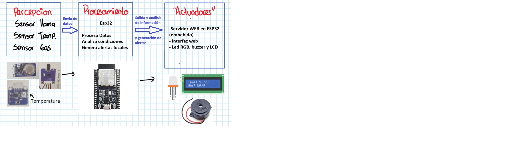


### 2.3 Desarrollo Teórico Modular

#### **Principios de Diseño del Sistema**
- **Fiabilidad:** Uso de sensores calibrados para evitar falsas alarmas.
- **Bajo Consumo Energético:** Optimización del código para minimizar el consumo de energía.
- **Interfaz Intuitiva:** Uso de una pantalla LCD y alertas sonoras para notificaciones claras.
- **Escalabilidad:** Posibilidad de agregar conectividad remota en versiones futuras.


## **Definición de umbrales de seguridad**

Para garantizar una detección confiable de incendios, se establecieron los siguientes umbrales en el sistema:

- **Temperatura máxima aceptable:** `TEMP_MAX = 30°C`
- **Nivel máximo de gas permitido:** `GAS_MAX = 700`
- **Cambio brusco de temperatura:** Se define como un incremento mayor a `5°C` en comparación con la lectura anterior.

Estos valores permiten detectar condiciones anómalas en el ambiente y activar una alerta en caso de peligro.

### **Justificación del umbral de temperatura**

Según el planteamiento inicial del reto, la zona de interés presenta temperaturas medias anuales entre **8.4°C y 13°C**.  
Sin embargo, se decidió establecer un umbral superior de **30°C** para la activación de alertas por las siguientes razones:

1. **Prevención de falsas alarmas:**  
   - En condiciones normales, un umbral demasiado bajo podría generar **alertas innecesarias**, activándose por aumentos naturales de temperatura.
   - Se buscó un equilibrio entre sensibilidad y precisión en la detección de incendios.

2. **Consideración de escenarios extremos:**  
   - En ciertas circunstancias (como exposición solar directa, equipos en funcionamiento o ventilación deficiente), la temperatura en el entorno puede superar los valores promedio de la región.
   - Un umbral más alto permite descartar estas fluctuaciones y centrarse en **situaciones realmente peligrosas**.

3. **Adaptación a condiciones reales de incendio:**  
  - Según el documento "Las fases de un incendio", durante la fase de incremento de un incendio, la temperatura aumenta rápidamente, situándose entre los 300°C y los 700°C. [5] Este incremento significativo de temperatura en las etapas iniciales de un incendio respalda la decisión de establecer un umbral de 30°C en nuestro sistema de detección. Aunque las temperaturas medias anuales en la zona de interés varían entre 8.4°C y 13°C, un aumento repentino que supere los 30°C podría indicar una situación anómala que requiera atención inmediata. Por lo tanto, este umbral permite detectar de manera efectiva un incipiente foco de incendio sin comprometer la confiabilidad del sistema.​   

4. **Resultados observados en la fase de pruebas de laboratorio:**  
   - Durante las pruebas en el laboratorio, se registraron temperaturas promedio entre **25°C y 27°C**.  
   - Esto evidenció que, aunque las temperaturas externas sean más bajas, el ambiente de prueba puede ser significativamente más cálido.  
   - Debido a esto, **se estableció 30°C como un valor adecuado para definir una temperatura "alta"**, asegurando que las alertas solo se activen en condiciones realmente anómalas.


## **Condiciones de activación de alerta**
El sistema genera una alerta cuando ocurre cualquiera de las siguientes condiciones:

1. **Sobrecalentamiento y gas elevado:** La temperatura supera los `30°C` y el nivel de gas es mayor a `700`.
2. **Presencia de llama:** Se detecta una llama a través del sensor (`PIN_LLAMAS`).
3. **Cambio brusco de temperatura:** Se registra un incremento superior a `5°C` en comparación con la última medición.

Cuando se activa una de estas condiciones, el sistema toma medidas inmediatas para alertar al usuario.


## **Consideraciones del entorno de laboratorio**
Las condiciones ambientales en el laboratorio difieren del entorno final donde se implementará el sistema. Por este motivo:

- Se ajustaron los umbrales para adaptarse al entorno de prueba y minimizar **falsos positivos**.
- Se añadió un umbral para detectar cambios bruscos de temperatura (`>5°C`), mejorando la precisión en la identificación de incendios.

Estos ajustes garantizan que el sistema responda correctamente sin generar alertas innecesarias.


## **Funcionamiento de la detección de cambios bruscos de temperatura**
El sistema monitorea la temperatura de forma continua para identificar cambios abruptos:

1. **Comparación de lecturas:** Se compara la temperatura actual (`valorTemp`) con la última registrada (`tempAnt`).
2. **Detección de incremento abrupto:** Si la diferencia supera `5°C`, se activa el indicador `saltoTemp = true`.
3. **Registro y notificación:**
   - El evento se almacena en el sistema de logs.
   - La información se envía a la interfaz web para que el usuario la visualice en tiempo real.


## **Intervalo de detección de cambios de temperatura**
- La temperatura se actualiza cada `500 ms` (`refresco = 500`), permitiendo una detección casi en **tiempo real**.
- Esto garantiza que cualquier cambio repentino se registre de manera inmediata y se tomen acciones rápidas.

## **Respuesta del sistema ante detección de incendio**
Si se activa una alerta por alguna de las condiciones previamente definidas, el sistema ejecuta las siguientes acciones:

**Indicadores visuales y auditivos:**
- Se enciende el **LED RGB en rojo** para señalar peligro.
- Se activa el **zumbador (buzzer)** con una frecuencia de `1000 Hz`.
- La pantalla **LCD muestra el mensaje "FUEGO!"** para alertar al usuario.

**Monitoreo en tiempo real:**
- La alerta y los datos del sensor se envían a la **interfaz web embebida**.
- El usuario puede visualizar en línea el estado del sistema y tomar decisiones inmediatas.


#### **2.4 Manejo de tareas concurrentes**

"Un hilo es la unidad de ejecución más pequeña de un programa. El multihilo permite que un programa realice múltiples tareas simultáneamente al dividir su carga de trabajo en componentes más pequeños, ejecutables independientemente, llamados hilos" [6]

El sistema utiliza hilos mediante el sistema operativo en tiempo real (RTOS) FreeRTOS, que está integrado en el framework del ESP32. FreeRTOS permite la ejecución concurrente de tareas (hilos) en el microcontrolador, lo que mejora la capacidad del sistema para realizar múltiples operaciones de manera simultánea.

- **Implementación de Hilos**:

  El sistema crea un hilo (o tarea) en la función setup() utilizando la API de FreeRTOS

      xTaskCreate(leerSensores, "Sensores", 4096, NULL, 1, NULL);

  - LeerSensores: Es la función que se ejecuta en el hilo. Esta función se encarga de leer los sensores de temperatura, gas, y llama, y actualizar las variables globales (valorTemp, valorGas, hayLlama).
  - "Sensores": Nombre asignado a la tarea para identificarla.
  - 4096: Tamaño de la pila (stack) asignada a la tarea, en bytes. Esto determina cuánta memoria se reserva para la tarea.
  - NULL: Parámetro que se pasa a la función leerSensores
  - 1: Prioridad de la tarea. Un valor de 1 indica una prioridad baja (en FreeRTOS, las prioridades más altas tienen mayor precedencia).
  - NULL: Handle de la tarea (no se guarda, ya que no se necesita manipular la tarea después de crearla).

 La función leerSensores se ejecuta en un bucle infinito dentro del hilo:

         void leerSensores(void *arg) {
         tempSensor.begin();
         analogReadResolution(10);
       
         for (;;) {
           tempSensor.requestTemperatures();
           float t = tempSensor.getTempCByIndex(0);
           int g = analogRead(gasPin);
           bool f = !digitalRead(PIN_LLAMAS);
       
           valorTemp = t;
           valorGas = g;
           hayLlama = f;
       
           logDatos[logPos] = {t, g, f, millis()};
           logPos = (logPos + 1) % REG_MAX;
           if (logCant < REG_MAX) logCant++;
       
           vTaskDelay(pdMS_TO_TICKS(200));
         }
        }
 
   - Inicialización: Configura el sensor de temperatura (tempSensor.begin()) y la resolución del ADC (analogReadResolution(10)).
   - Lectura de Sensores:
     - Lee la temperatura (tempSensor.getTempCByIndex(0)).
     - Lee el nivel de gas (analogRead(gasPin)).
     - Detecta la presencia de llama (digitalRead(PIN_LLAMAS)).
   - Actualización de Variables: Actualiza las variables globales valorTemp, valorGas, y hayLlama, que son usadas por el loop() para tomar decisiones.
   - Registro de Datos: Almacena las lecturas en el historial (logDatos), actualizando logPos y logCant.
   - Pausa: Usa vTaskDelay(pdMS_TO_TICKS(200)) para pausar la tarea durante 200 milisegundos en cada iteración. Esto permite que otras tareas (como el loop()) se ejecuten, evitando que el hilo monopolice el procesador.

 **Propósito de los Hilos**

 - ***Lectura Concurrente de Sensores:*** El hilo leerSensores permite que la lectura de los sensores se realice de manera independiente y concurrente con otras operaciones del sistema, como el manejo del servidor web (webServ.handleClient()) y la actualización del LCD, LED RGB, y buzzer en loop().
 - ***Evitar Bloqueos:*** Al delegar la lectura de sensores a un hilo separado, el loop() no se bloquea esperando las lecturas, lo que asegura que el sistema sea más responsivo. Por ejemplo, el servidor web puede responder a solicitudes HTTP (como /data o /history) sin interrupciones.
 - ***Actualización Periódica:*** La tarea leerSensores lee los sensores cada 200 ms, garantizando que las variables globales siempre tengan datos actualizados para que el loop() las use en la lógica de control (e.g., activar alarmas, actualizar el LCD).
 - ***Escalabilidad:*** El uso de FreeRTOS permite añadir más tareas en el futuro (e.g., una tarea para manejar actuadores o enviar datos a la nube) sin afectar el flujo principal del programa.

 **Funcionamiento General con Hilos:**

El sistema tiene dos hilos principales que se ejecutan concurrentemente:

 - ***Hilo Principal (loop()):***
   - Ejecuta el bucle principal del programa.
   - Maneja el servidor web (webServ.handleClient()).
   - Verifica las condiciones de alarma (saltoTemp, valorGas > GAS_MAX, valorTemp > TEMP_MAX, hayLlama).
   - Actualiza el LCD con los valores de los sensores o mensajes de alerta ("FUEGO!", "Posible incendio!").
   - Controla el LED RGB (pintarRGB) y el buzzer (tone/noTone) según el estado del sistema.
   - Se ejecuta cada 10 ms (delay(10) al final del loop()), pero también comparte el procesador con otras tareas.
 - ***Hilo leerSensores:***
   - Ejecuta la función leerSensores en un bucle infinito.
   - Lee los sensores cada 200 ms y actualiza las variables globales.
   - Almacena las lecturas en el historial (logDatos).
   - Se pausa 200 ms en cada iteración para permitir que el hilo principal y otras tareas se ejecuten.

Sincronización: Las variables globales (valorTemp, valorGas, hayLlama, logDatos, etc.) son compartidas entre los hilos. Para evitar problemas de concurrencia, estas variables están marcadas como ***volatile***, lo que asegura que el compilador no optimice el acceso a ellas y que los cambios realizados por un hilo sean visibles para el otro. 


#### **2.5 Diagramas UML**
1. **Diagrama de Caso de Uso**: Describe la interacción entre los usuarios y el sistema
<p align="center">
  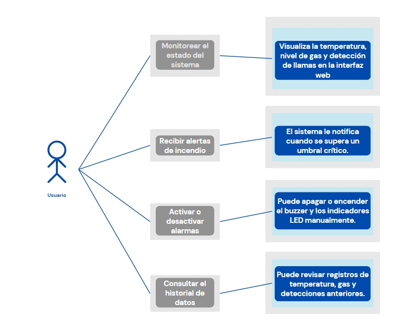
  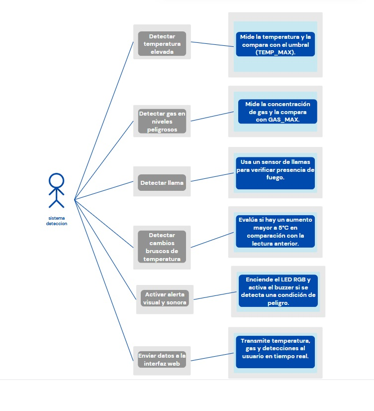
</p>

   
2. **Diagrama de Clases**: Representación de la estructura del software.

<p align="center">
  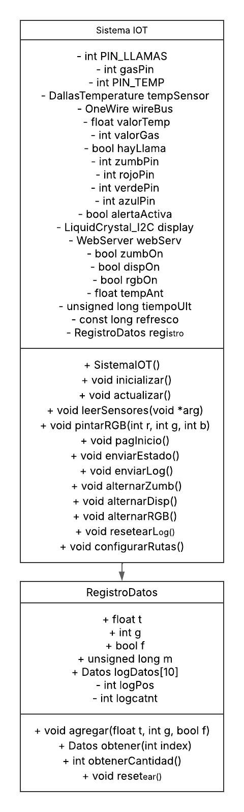
</p>

3. **Diagrama de Secuencia**: Flujo de datos y eventos en el sistema.
<p align="center">
  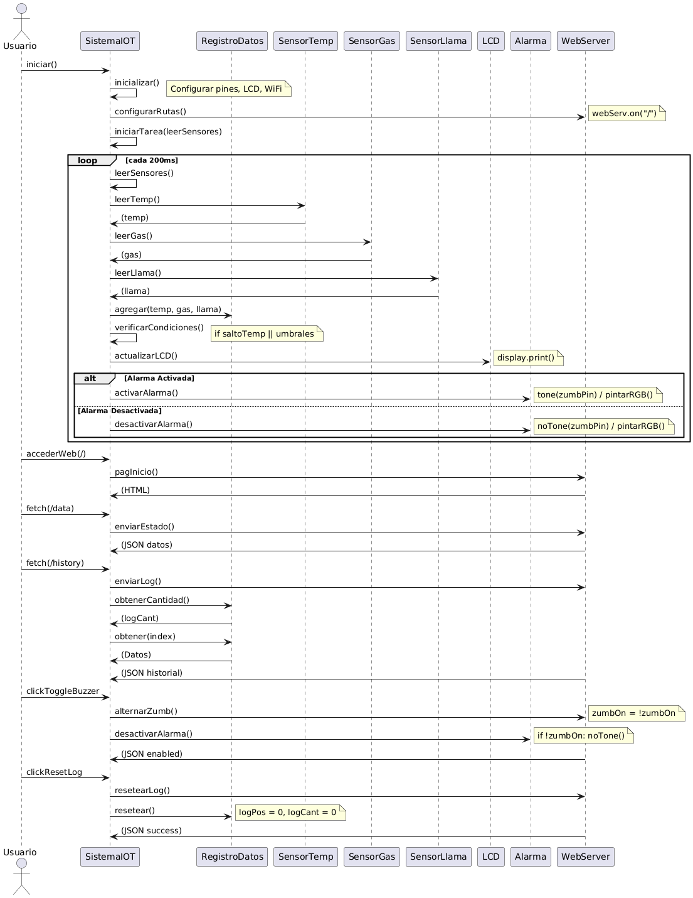
</p>
   

4. **Diagrama de Estados:** Estados del sistema según las condiciones detectadas.

*Estado: Inicio*
  - Inicializa sensores, LCD, WiFi, servidor web, y crea hilo leerSensores.
  - Transición a → Monitoreo Normal.

*Estado: Monitoreo Normal*
  - Lee sensores de temperatura, gas y llama (hilo leerSensores).
  - Muestra valores en LCD (T: valorTemp, G: valorGas) si dispOn.
  - LED RGB: Verde (125, 0, 255) si rgbOn.
  - Buzzer: Apagado si zumbOn.
  - Si valorGas > 700 || valorTemp > 30 → Transición a Detección de Gas o Temperatura Alta.
  - Si hayLlama → Transición a Detección de Llama.
  - Si abs(valorTemp - tempAnt) > 5 || (valorGas > 700 && valorTemp > 30) → Transición a Alarma Activada (Posible Incendio).

*Estado: Detección de Gas o Temperatura Alta*
  - Muestra valores en LCD (T: valorTemp, G: valorGas) si dispOn.
  - LED RGB: Amarillo (0, 0, 255) si rgbOn.
  - Buzzer: Apagado si zumbOn.
  - Si abs(valorTemp - tempAnt) > 5 || (valorGas > 700 && valorTemp > 30) → Transición a Alarma Activada (Posible Incendio).
  - Si hayLlama → Transición a Detección de Llama.
  - Si valorGas <= 700 && valorTemp <= 30 → Transición a Monitoreo Normal.

*Estado: Detección de Llama*
  - Muestra "FUEGO!" en LCD si dispOn.
  - LED RGB: Rojo (0, 255, 255) si rgbOn.
  - Buzzer: Activado (tone 1000 Hz) si zumbOn.
  - alertaActiva = true.
  - Transición inmediata a → Alarma Activada.

*Estado: Alarma Activada (Posible Incendio)*
  - Muestra "Posible incendio!" en LCD si dispOn.
  - LED RGB: Rojo (0, 125, 255) si rgbOn.
  - Buzzer: Activado (tone 1000 Hz) si zumbOn.
  - alertaActiva = true.
  - Si hayLlama → Transición a Detección de Llama.
  - Si !hayLlama && valorGas <= 700 && valorTemp <= 30 && !saltoTemp → Transición a Alarma Desactivada.

*Estado: Alarma Activada*
  - Estado general para alertaActiva = true (causado por Detección de Llama o Alarma Activada (Posible Incendio)).
  - Si !hayLlama && valorGas <= 700 && valorTemp <= 30 && !saltoTemp → Transición a Alarma Desactivada.

*Estado: Alarma Desactivada*
  - Apaga buzzer (noTone) si zumbOn.
  - Ajusta LED RGB según estado (Verde o Amarillo) si rgbOn.
  - alertaActiva = false.
  - Si valorGas <= 700 && valorTemp <= 30 → Transición a Monitoreo Normal.
  - Si valorGas > 700 || valorTemp > 30 → Transición a Detección de Gas o Temperatura Alta.

#### **2.5 Estándares de Diseño Aplicados**
La tecnología **Wi-Fi** se basa en la serie de estándares de conectividad inalámbrica **IEEE 802.11™**, los cuales han revolucionado la forma en que nos comunicamos y accedemos a la información [7].  
En este código, se usa a través de la biblioteca `WiFi.h`, que permite conectar el **ESP32** a una red WiFi.

**¿Cómo se usa el protocolo IEEE 802.11 y HTTP?**

El protocolo **IEEE 802.11** define los estándares para redes WiFi, y en este código se emplea para:

- **Conectar el ESP32 a una red WiFi**  
  - Se utiliza `WiFi.begin(redNombre, redClave);` en el `setup()`, lo que permite la autenticación con una red **WiFi de 2.4 GHz**.
  - `WiFi.status()` verifica que la conexión se haya establecido correctamente.
  - `WiFi.localIP()` imprime la dirección **IP asignada** al ESP32 en la red.

- **Implementar un Servidor Web**  
  - Se usa la biblioteca `WebServer.h`, que actúa como un servidor **HTTP** sobre la red WiFi.
  - Permite que los clientes (por ejemplo, navegadores web) accedan a la página de control del sistema mediante **peticiones HTTP**:  
    ```cpp
    webServ.on("/", HTTP_GET, pagInicio);
    ```

- **Enviar y recibir datos a través de HTTP**  
  - El ESP32 envía información de los sensores en formato **JSON**:  
    ```cpp
    webServ.on("/data", HTTP_GET, enviarEstado);
    ```
  - También responde a **comandos de los usuarios** para activar/desactivar componentes como el zumbador, la pantalla LCD y el LED RGB:  
    ```cpp
    webServ.on("/toggleBuzzer", HTTP_GET, alternarZumb);
    ```

#### **2.6 Estándares de Diseño Aplicados**

**1. Diseño Modular**  
- Se basa en el principio de **separación de preocupaciones** (*Separation of Concerns*), que facilita la escalabilidad y mantenimiento del código.  
- Permite reutilizar módulos sin afectar el sistema completo.  
- Relacionado con los principios **SOLID** en ingeniería de software, específicamente el principio de **Responsabilidad Única (SRP)**.  

**2. Programación Concurrente (FreeRTOS)**  
- Uso de **sistemas operativos en tiempo real (RTOS)** para gestionar múltiples tareas sin bloqueo.  
- Asegura una **baja latencia** y una mejor **responsividad** en sistemas embebidos.  
- Se alinea con estándares como **IEEE 1003 (POSIX Threads)** y prácticas de **sistemas concurrentes**.  

**3. Arquitectura Cliente-Servidor**  
- Sigue el estándar de **arquitectura distribuida** usado en la web y en sistemas embebidos.  
- Basado en el modelo **RESTful** para estructurar la comunicación entre cliente y servidor.  
- Compatible con estándares de **HTTP/HTTPS (RFC 2616, RFC 7231)** y protocolos de comunicación embebida.  

**4. Manejo de Recursos Compartidos**  
- Uso de variables **volatile** y técnicas de sincronización para evitar **condiciones de carrera**.  
- Relacionado con estándares de **sistemas concurrentes y paralelos** (por ejemplo, **ISO/IEC 9899:2011 - C11** para programación en C).  

**5. Diseño Basado en Estados**  
- Implementa una **Máquina de Estados Finitos (FSM, *Finite State Machine*)**, un enfoque común en sistemas embebidos.  
- Se alinea con prácticas de diseño en **automatización y control**, como **IEC 61131-3** para sistemas de control industrial.  

**6. Manejo de Errores**  
- Uso de estrategias de **reconexión WiFi automática** y validaciones en la interfaz web.  
- Implementación de **mecanismos de detección y corrección de fallos** en el software.  
- Basado en principios de **tolerancia a fallos** en sistemas embebidos.  

## 3. Configuración Experimental y Resultados

### 3.1 Metodología de Pruebas

- **Prueba de Sensores:**  
  Se realizó la validación de los datos de temperatura, niveles de gas y detección de llama en distintos entornos. En el laboratorio se compararon las mediciones obtenidas por el sistema con instrumentos calibrados, mientras que en pruebas de campo se evaluó la respuesta de los sensores ante condiciones ambientales variables. Esto permitió ajustar los umbrales (por ejemplo, 30°C para temperatura y 700 unidades para gas) y confirmar la capacidad del sistema para identificar incrementos bruscos (mayor a 5°C) de manera oportuna.

- **Prueba del Servidor Web:**  
  Se verificó la accesibilidad y funcionalidad del servidor web embebido en el ESP32. La interfaz fue probada desde diferentes dispositivos (computadoras, smartphones y tablets) conectados a la WLAN proporcionada por la alcaldía. Se evaluó la actualización en tiempo real de los datos, la correcta visualización del estado de los sensores, y la respuesta a comandos para alternar el estado de actuadores (buzzer, LCD y LED RGB).

- **Prueba de Alertas:**  
  Se simuló la activación de condiciones anómalas generadas por sobrecalentamiento, niveles elevados de gas y detección de llama. En estas pruebas se comprobó que, al superar los umbrales establecidos, el sistema activara simultáneamente los indicadores físicos:
  - **LED RGB:** Cambia a color rojo o amarillo según la gravedad de la situación.
  - **Buzzer:** Emite una señal sonora de 1000 Hz para alertar inmediatamente.
  - **Pantalla LCD:** Muestra mensajes de advertencia (“FUEGO!” o “Posible incendio!”).  
  Estas pruebas ayudaron a ajustar la sincronización y a minimizar las falsas alarmas.

- **Simulación de Incendio:**  
  Se empleó una fuente controlada (por ejemplo, un encendedor) para simular la presencia de fuego y evaluar la respuesta del sistema. Se midió el tiempo transcurrido desde la detección de la señal de llama hasta la activación completa de las alertas, constatando la capacidad del sistema para reaccionar en tiempo real ante un inicio de incendio.

### 3.2 Resultados

- **Detección en Tiempo Real:**  
  Se evidenció la capacidad del sistema para detectar aumentos bruscos de temperatura en tiempo real, identificando incrementos superiores a 5°C en un corto intervalo. Esto es fundamental para la detección temprana de posibles incendios.

- **Interfaz Web Funcional:**  
  La plataforma web demostró ser completamente operativa, mostrando en vivo el estado actual de las variables (temperatura, gas y detección de llama) y ofreciendo un historial reciente de lecturas. La actualización en tiempo real permitió a los usuarios monitorear de forma remota y precisa el estado del entorno.

- **Activación de Alertas:**  
  Las pruebas confirmaron que, en condiciones críticas, el sistema activa de forma coordinada todos los mecanismos de alerta (buzzer, LED RGB y mensajes en la pantalla LCD). Esto asegura una respuesta inmediata ante la detección de condiciones anómalas, reduciendo el riesgo de que un incendio se propague sin ser atendido.

## 4. Autoevaluación del Protocolo de Pruebas

- **Precisión:**  
  Las mediciones obtenidas por los sensores fueron comparadas con instrumentos de referencia calibrados, constatando que los datos de temperatura, niveles de gas y detección de llama se encuentran dentro de márgenes de error aceptables para aplicaciones en tiempo real. Esto valida la exactitud de las lecturas y la pertinencia de los umbrales establecidos.

- **Fiabilidad:**  
  Se realizaron pruebas repetidas en diversos escenarios y condiciones ambientales (laboratorio, pruebas de campo y simulaciones controladas). La consistencia en los resultados, junto con la correcta activación de alertas ante condiciones anómalas, demostró la robustez y confiabilidad del sistema.

- **Escalabilidad:**  
  El diseño modular y el uso de FreeRTOS facilitan la integración de nuevos sensores y funcionalidades sin afectar el rendimiento general. Las pruebas evidenciaron que el sistema puede ampliarse para incorporar más variables de monitoreo, lo que lo hace adaptable a escenarios de mayor complejidad o a la integración con otros sistemas de gestión de emergencias.

## 5. Conclusiones y Trabajo Futuro

### 5.1 Retos Presentados Durante el Desarrollo

- **Calibración de Sensores:**  
  La integración y calibración de los distintos sensores (temperatura, gas y llama) representaron un desafío, ya que se debía asegurar la coherencia entre las mediciones y evitar falsas alarmas derivadas de variaciones ambientales naturales.

- **Gestión de Tareas Concurrentes:**  
  La implementación de FreeRTOS para el manejo de hilos requirió una cuidadosa asignación de recursos y sincronización de variables compartidas para garantizar que las tareas (lectura de sensores, actualización de la interfaz web y control de actuadores) se ejecutaran de manera eficiente y sin conflictos.

- **Interfaz Web y Conectividad:**  
  Adaptar la interfaz web para que fuera accesible y funcional desde múltiples dispositivos, así como garantizar la estabilidad de la conexión a la red WLAN, implicó superar desafíos relacionados con la comunicación y la gestión de solicitudes HTTP en tiempo real.

- **Tolerancia a Fallos:**  
  Se presentó la necesidad de implementar mecanismos de reconexión y manejo de errores para mantener la operatividad del sistema en entornos con variaciones en la conectividad o en condiciones ambientales extremas.
- **Problemas con el Sensor de Temperatura:**
Al inicio del desarrollo, el sensor de temperatura (DS18B20) no funcionaba; por más que lo intentamos, no sensaba nada, devolviendo valores erróneos como -127°C. Unos días después, probamos con otro código de ejemplo y el sensor funcionó correctamente, lo que nos permitió confirmar que el hardware estaba operativo. Sin embargo, al volver a cargar nuestro código inicial, el sensor dejó de funcionar nuevamente. Decidimos cargar otra vez el código que sí funcionaba, pero para nuestra sorpresa, ya no operaba. Tras reiniciar el computador y realizar varias pruebas, concluimos que había un código residual en el microcontrolador que lo estaba deshabilitando, posiblemente debido a una configuración incorrecta del bus OneWire o un conflicto con otras librerías. Finalmente, resolvimos el problema limpiando la memoria del ESP32
- **Dificultad en la obtención e instalación de librerías:** Para poder trabajar con el sensor DS18B20 y la pantalla LCD, fue necesario encontrar e instalar las librerías adecuadas. En particular, usamos las siguientes:
  - OneWire.h: Para la comunicación con el sensor de temperatura DS18B20.
  - DallasTemperature.h: Para procesar los datos del sensor DS18B20.
  - Wire.h y LiquidCrystal_I2C.h: Para manejar la pantalla LCD con comunicación I2C.

Encontrar las versiones correctas y lograr que funcionaran correctamente en el entorno de desarrollo tomó tiempo.

### 5.2 Conclusiones

El desarrollo del sistema IoT para la detección temprana de incendios en los cerros orientales de Bogotá ha demostrado ser una solución viable y de bajo costo para enfrentar riesgos ambientales. Se concluye que:

- La integración de sensores, actuadores y una interfaz web permite una monitorización en tiempo real y una respuesta rápida ante condiciones de riesgo.
- La arquitectura modular y el uso de FreeRTOS facilitan la escalabilidad y el mantenimiento del sistema, permitiendo futuras expansiones y mejoras.
- Las pruebas realizadas confirman la precisión y fiabilidad del sistema, así como su capacidad para activar alertas de manera efectiva y coordinada.
- La solución propuesta contribuye significativamente a la prevención y mitigación de incendios forestales, ofreciendo un sistema de alerta temprana que puede ser implementado en zonas vulnerables.

### 5.3 Trabajo Futuro

- **Incorporación de Nuevos Sensores:**  
  Integrar sensores adicionales, como detectores de humo, humedad y velocidad del viento, para obtener una visión más completa de las condiciones ambientales y mejorar la detección temprana de incendios o mejora de estos sensores ya implementado asi mismo como su mejor manejo y mayor amplitud paa su implementacion.

- **Optimización del Algoritmo de Detección:**  
  Refinar los algoritmos de análisis de datos para reducir las falsas alarmas y aumentar la precisión en la detección de condiciones anómalas, utilizando técnicas de procesamiento de señales y machine learning.

- **Mejoras en la Comunicación:**  
  Evaluar la posibilidad de implementar tecnologías de comunicación de largo alcance (como redes 4G/5G) para ampliar la cobertura del sistema, especialmente en zonas de difícil acceso.

- **Desarrollo de Aplicaciones Móviles:**  
  Crear una aplicación móvil complementaria a la interfaz web que permita a los usuarios recibir notificaciones en tiempo real, gestionar alertas y monitorear el estado del sistema desde cualquier lugar.

- **Pruebas a Escala Real:**  
  Realizar pruebas piloto en campo en colaboración con autoridades locales para validar el sistema en condiciones reales y ajustar parámetros en función de los resultados obtenidos, lo que permitirá adaptar y mejorar la solución para implementaciones a gran escala.

## **6. Anexos**
### Codigo comentado

          #include <WiFi.h>              // Librería para conectar el ESP32 a una red WiFi
          #include <WebServer.h>         // Librería para crear un servidor web en el ESP32
          #include <Wire.h>              // Librería para comunicación I2C (usada por el LCD)
          #include <LiquidCrystal_I2C.h> // Librería para controlar el display LCD I2C
          #include <OneWire.h>           // Librería para comunicación con sensores OneWire (temperatura)
          #include <DallasTemperature.h> // Librería para leer el sensor de temperatura DS18B20
          
          // Definición de credenciales de la red WiFi
          const char* redNombre = "Zflip de Valentina"; // Nombre de la red WiFi
          const char* redClave = "v4l32006";            // Contraseña de la red WiFi
          
          // Creación de un servidor web en el puerto 80
          WebServer webServ(80);
          
          // Definición de umbrales para las condiciones de alarma
          #define TEMP_MAX 30  // Temperatura máxima permitida (30°C)
          #define GAS_MAX 700  // Nivel máximo de gas permitido (700 unidades)
          
          // Definición de pines para los sensores
          #define PIN_LLAMAS 15 // Pin para el sensor de llama (digital)
          #define PIN_TEMP 4    // Pin para el sensor de temperatura (OneWire)
          
          // Definición de pines para los actuadores
          const int zumbPin = 27;   // Pin para el buzzer (zumbador)
          const int gasPin = 35;    // Pin para el sensor de gas (analógico)
          const int rojoPin = 19;   // Pin para el canal rojo del LED RGB
          const int verdePin = 18;  // Pin para el canal verde del LED RGB
          const int azulPin = 5;    // Pin para el canal azul del LED RGB
          
          // Inicialización de objetos para el hardware
          LiquidCrystal_I2C display(0x27, 16, 2); // Display LCD I2C (dirección 0x27, 16 columnas, 2 filas)
          OneWire wireBus(PIN_TEMP);              // Objeto para comunicación OneWire en el pin de temperatura
          DallasTemperature tempSensor(&wireBus);  // Objeto para leer el sensor de temperatura DS18B20
          
          // Variables globales para almacenar las lecturas de los sensores
          volatile float valorTemp = 0.0; // Temperatura actual (volatile para uso en hilos)
          volatile int valorGas = 0;      // Nivel de gas actual (volatile para uso en hilos)
          volatile bool hayLlama = false; // Estado del sensor de llama (true si hay llama, volatile para uso en hilos)
          volatile bool alertaActiva = false; // Indica si hay una alerta activa (volatile para uso en hilos)
          float tempAnt = 0;              // Temperatura anterior para detectar incrementos bruscos
          unsigned long tiempoUlt = 0;    // Última vez que se actualizó el sistema (en milisegundos)
          const long refresco = 500;      // Intervalo de actualización del sistema (500 ms)
          
          // Variables para controlar el estado de los actuadores
          volatile bool zumbOn = true; // Estado del buzzer (true: encendido, false: apagado)
          volatile bool dispOn = true;  // Estado del display LCD (true: encendido, false: apagado)
          volatile bool rgbOn = true;   // Estado del LED RGB (true: encendido, false: apagado)
          
          // Estructura para almacenar las lecturas de los sensores en el historial
          struct Datos {
            float t;           // Temperatura
            int g;             // Nivel de gas
            bool f;            // Estado de la llama (true: hay llama)
            unsigned long m;   // Tiempo de la lectura (en milisegundos)
          };
          
          // Definición del historial de lecturas
          #define REG_MAX 10         // Máximo número de registros en el historial
          Datos logDatos[REG_MAX];   // Arreglo para almacenar el historial
          int logPos = 0;            // Posición actual en el historial (índice circular)
          int logCant = 0;           // Cantidad de registros almacenados
          
          // Función para controlar el LED RGB
          void pintarRGB(int r, int g, int b) {
            if (rgbOn) { // Verifica si el LED RGB está habilitado
              digitalWrite(rojoPin, r);   // Establece el valor del canal rojo
              digitalWrite(verdePin, g);  // Establece el valor del canal verde
              digitalWrite(azulPin, b);   // Establece el valor del canal azul
            } else { // Si el LED RGB está deshabilitado, apaga todos los canales
              digitalWrite(rojoPin, 0);
              digitalWrite(verdePin, 0);
              digitalWrite(azulPin, 0);
            }
          }
          
          // Función que se ejecuta en un hilo para leer los sensores
          void leerSensores(void *arg) {
            tempSensor.begin();         // Inicializa el sensor de temperatura
            analogReadResolution(10);   // Configura la resolución del ADC a 10 bits
          
            for (;;) { // Bucle infinito para leer los sensores continuamente
              tempSensor.requestTemperatures(); // Solicita la temperatura al sensor
              float t = tempSensor.getTempCByIndex(0); // Lee la temperatura en °C
              int g = analogRead(gasPin);              // Lee el nivel de gas (analógico)
              bool f = !digitalRead(PIN_LLAMAS);       // Lee el sensor de llama (LOW indica presencia de llama)
          
              // Actualiza las variables globales con las lecturas
              valorTemp = t;
              valorGas = g;
              hayLlama = f;
          
              // Almacena la lectura en el historial
              logDatos[logPos] = {t, g, f, millis()}; // Registra temperatura, gas, llama y tiempo
              logPos = (logPos + 1) % REG_MAX;        // Avanza la posición circularmente
              if (logCant < REG_MAX) logCant++;       // Incrementa el contador de registros hasta el máximo
          
              vTaskDelay(pdMS_TO_TICKS(200)); // Pausa la tarea 200 ms para permitir otras tareas
            }
          }
          
          // Función para servir la página web principal
          void pagInicio() {
            // HTML, CSS y JavaScript de la interfaz web
            String html = R"rawliteral(
          <!DOCTYPE html>
          <html lang="es">
          <head>
          <meta charset="UTF-8">
          <meta name="viewport" content="width=device-width, initial-scale=1">
          <title>Control Incendios</title>
          <style>
          body {font-family: 'Segoe UI', sans-serif; background: linear-gradient(135deg, #1e3c72, #2a5298); margin: 0; padding: 20px; color: #fff;}
          .contenedor {display: flex; flex-wrap: wrap; gap: 20px; max-width: 1200px; margin: 0 auto;}
          .bloque {background: rgba(255, 255, 255, 0.1); border-radius: 15px; padding: 20px; flex: 1; min-width: 250px; box-shadow: 0 4px 15px rgba(0, 0, 0, 0.2); backdrop-filter: blur(5px);}
          .bloque h2 {margin: 0 0 10px; font-size: 24px; color: #ffd700;}
          .bloque p {margin: 5px 0; font-size: 18px;}
          .aviso {background: #ff4444; padding: 10px; border-radius: 10px; margin-top: 10px; font-weight: bold;}
          .registros {max-height: 400px; overflow-y: auto;}
          .registros table {width: 100%; border-collapse: collapse; color: #fff;}
          .registros th, .registros td {padding: 8px; text-align: center; border-bottom: 1px solid rgba(255, 255, 255, 0.2);}
          .registros th {background: rgba(255, 215, 0, 0.3);}
          .opciones {display: flex; flex-direction: column; gap: 10px; margin-top: 20px;}
          .fila-botones {display: flex; gap: 10px; flex-wrap: wrap;}
          button {padding: 10px 20px; font-size: 16px; border: none; border-radius: 25px; cursor: pointer; background: #ffd700; color: #1e3c72; transition: background 0.3s;}
          button:hover {background: #ffea00;}
          </style>
          </head>
          <body>
          <div class="contenedor">
          <div class="bloque">
          <h2>Estado</h2>
          <p>Temperatura: <span id="t-val">-- °C</span></p>
          <p>Gas: <span id="g-val">--</span></p>
          <p>Llama: <span id="f-val">--</span></p>
          <div id="aviso-zona"></div>
          </div>
          <div class="bloque">
          <h2>Acciones</h2>
          <div class="opciones">
          <div class="fila-botones">
          <button onclick="switchZumb()">Zumbador: <span id="zumb-est">ON</span></button>
          <button onclick="switchDisp()">Display: <span id="disp-est">ON</span></button>
          <button onclick="switchRGB()">RGB: <span id="rgb-est">ON</span></button>
          </div>
          <div class="fila-botones">
          <button onclick="resetLog()">Resetear Log</button>
          </div>
          </div>
          </div>
          <div class="bloque registros">
          <h2>Log</h2>
          <table id="log-tabla">
          <tr><th>Tiempo (s)</th><th>Temp (°C)</th><th>Gas</th><th>Llama</th></tr>
          </table>
          </div>
          </div>
          <script>
          function cargarEstado() {
          fetch('/data').then(r => r.json()).then(d => {
          document.getElementById("t-val").innerText = d.temperatura + " °C";
          document.getElementById("g-val").innerText = d.gas;
          document.getElementById("f-val").innerText = d.llama ? "SÍ" : "NO";
          let avisoZona = document.getElementById("aviso-zona");
          if (d.llama) {
          avisoZona.innerHTML = '<div class="aviso">¡PELIGRO: FUEGO!</div>';
          } else if (d.incremento_brusco || (d.temperatura > 30 && d.gas > 700)){
          avisoZona.innerHTML = '<div class="aviso">¡PELIGRO: POSIBLE INCENDIO!</div>';
          }
          else{
          avisoZona.innerHTML = '';
          }
          });
          }
          function cargarLog() {
          fetch('/history').then(r => r.json()).then(h => {
          let tabla = document.getElementById("log-tabla");
          tabla.innerHTML = "<tr><th>Tiempo (s)</th><th>Temp (°C)</th><th>Gas</th><th>Llama</th></tr>";
          for (let i = 0; i < h.length; i++) {
          let fila = tabla.insertRow();
          fila.insertCell(0).innerText = h[i].timestamp;
          fila.insertCell(1).innerText = h[i].temp;
          fila.insertCell(2).innerText = h[i].gas;
          fila.insertCell(3).innerText = h[i].flame ? "SÍ" : "NO";
          }
          });
          }
          function switchZumb() {
          fetch('/toggleBuzzer').then(r => r.json()).then(d => {
          document.getElementById("zumb-est").innerText = d.enabled ? "ON" : "OFF";
          });
          }
          function switchDisp() {
          fetch('/toggleLCD').then(r => r.json()).then(d => {
          document.getElementById("disp-est").innerText = d.enabled ? "ON" : "OFF";
          });
          }
          function switchRGB() {
          fetch('/toggleRGB').then(r => r.json()).then(d => {
          document.getElementById("rgb-est").innerText = d.enabled ? "ON" : "OFF";
          });
          }
          function resetLog() {
          fetch('/resetLog').then(r => r.json()).then(d => {
          if (d.success) cargarLog();
          });
          }
          setInterval(() => { cargarEstado(); cargarLog(); }, 1000);
          cargarEstado();
          cargarLog();
          </script>
          </body>
          </html>
            )rawliteral";
            webServ.send(200, "text/html", html); // Envía la página web al cliente
          }
          
          // Función para enviar el estado actual de los sensores en formato JSON
          void enviarEstado() {
            bool saltoTemp = abs(valorTemp - tempAnt) > 5; // Calcula si hay un incremento brusco de temperatura
            // Construye un JSON con los valores actuales
            String json = "{\"temperatura\":" + String(valorTemp, 2) + ",\"gas\":" + String(valorGas) + ",\"llama\":" + String(hayLlama ? "true" : "false") + ",\"incremento_brusco\":" + String(saltoTemp ? "true" : "false") + "}";
            webServ.send(200, "application/json", json); // Envía el JSON al cliente
          }
          
          // Función para enviar el historial de lecturas en formato JSON
          void enviarLog() {
            String json = "["; // Inicia un arreglo JSON
            for (int i = 0; i < logCant; i++) { // Itera sobre los registros del historial
              int idx = (logCant < REG_MAX ? i : (logPos + i) % REG_MAX); // Calcula el índice circular
              // Añade cada registro al JSON
              json += "{\"timestamp\":" + String(logDatos[idx].m / 1000) + ",\"temp\":" + String(logDatos[idx].t, 1) + ",\"gas\":" + String(logDatos[idx].g) + ",\"flame\":" + String(logDatos[idx].f ? "true" : "false") + "}";
              if (i < logCant - 1) json += ","; // Añade una coma entre registros
            }
            json += "]"; // Cierra el arreglo JSON
            webServ.send(200, "application/json", json); // Envía el JSON al cliente
          }
          
          // Función para alternar el estado del buzzer
          void alternarZumb() {
            zumbOn = !zumbOn; // Cambia el estado del buzzer (encendido/apagado)
            if (!zumbOn && alertaActiva) noTone(zumbPin); // Si se desactiva y hay alerta, apaga el buzzer
            // Responde con el nuevo estado en formato JSON
            webServ.send(200, "application/json", "{\"enabled\":" + String(zumbOn ? "true" : "false") + "}");
          }
          
          // Función para alternar el estado del display LCD
          void alternarDisp() {
            dispOn = !dispOn; // Cambia el estado del display (encendido/apagado)
            dispOn ? display.backlight() : display.noBacklight(); // Enciende o apaga la retroiluminación
            // Responde con el nuevo estado en formato JSON
            webServ.send(200, "application/json", "{\"enabled\":" + String(dispOn ? "true" : "false") + "}");
          }
          
          // Función para alternar el estado del LED RGB
          void alternarRGB() {
            rgbOn = !rgbOn; // Cambia el estado del LED RGB (encendido/apagado)
            if (!rgbOn) pintarRGB(255, 255, 255); // Si se desactiva, apaga el LED RGB
            // Responde con el nuevo estado en formato JSON
            webServ.send(200, "application/json", "{\"enabled\":" + String(rgbOn ? "true" : "false") + "}");
          }
          
          // Función para resetear el historial de lecturas
          void resetearLog() {
            logPos = 0;  // Reinicia la posición del historial
            logCant = 0; // Reinicia el contador de registros
            // Responde con un mensaje de éxito en formato JSON
            webServ.send(200, "application/json", "{\"success\":true}");
          }
          
          // Función de inicialización del sistema
          void setup() {
            // Configura los pines de los actuadores como salidas
            pinMode(zumbPin, OUTPUT);
            pinMode(rojoPin, OUTPUT);
            pinMode(verdePin, OUTPUT);
            pinMode(azulPin, OUTPUT);
            pinMode(PIN_LLAMAS, INPUT_PULLUP); // Configura el pin del sensor de llama con pull-up
          
            Wire.begin(21, 22); // Inicializa la comunicación I2C (pines SDA=21, SCL=22)
            display.init();     // Inicializa el display LCD
            display.backlight(); // Enciende la retroiluminación del LCD
            pintarRGB(0, 0, 0); // Apaga el LED RGB inicialmente
            display.setCursor(0, 0); // Posiciona el cursor en la primera línea
            display.print("Iniciando..."); // Muestra un mensaje de inicio
          
            Serial.begin(115200); // Inicia la comunicación serial para depuración
            WiFi.begin(redNombre, redClave); // Conecta a la red WiFi
            while (WiFi.status() != WL_CONNECTED) delay(1000); // Espera hasta que se conecte
            Serial.println(WiFi.localIP()); // Imprime la IP asignada
          
            // Configura las rutas del servidor web
            webServ.on("/", HTTP_GET, pagInicio);         // Ruta para la página principal
            webServ.on("/data", HTTP_GET, enviarEstado);  // Ruta para enviar el estado actual
            webServ.on("/history", HTTP_GET, enviarLog);  // Ruta para enviar el historial
            webServ.on("/toggleBuzzer", HTTP_GET, alternarZumb); // Ruta para alternar el buzzer
            webServ.on("/toggleLCD", HTTP_GET, alternarDisp);    // Ruta para alternar el LCD
            webServ.on("/toggleRGB", HTTP_GET, alternarRGB);     // Ruta para alternar el LED RGB
            webServ.on("/resetLog", HTTP_GET, resetearLog);      // Ruta para resetear el historial
            webServ.begin(); // Inicia el servidor web
          
            // Crea un hilo para leer los sensores usando FreeRTOS
            xTaskCreate(leerSensores, "Sensores", 4096, NULL, 1, NULL);
          }
          
          // Función principal que se ejecuta en un bucle
          void loop() {
            webServ.handleClient(); // Maneja las solicitudes del servidor web
          
            unsigned long ahora = millis(); // Obtiene el tiempo actual
            bool saltoTemp = abs(valorTemp - tempAnt) > 5; // Detecta un incremento brusco de temperatura
          
            // Actualiza el sistema cada 500 ms (definido por refresco)
            if (ahora - tiempoUlt >= refresco) {
              tiempoUlt = ahora; // Actualiza el tiempo de la última actualización
              if (dispOn) display.clear(); else display.noBacklight(); // Limpia el LCD o apaga la retroiluminación
          
              // Estado: Alarma Activada (Posible Incendio)
              if (saltoTemp || (valorTemp > TEMP_MAX && valorGas > GAS_MAX)) {
                alertaActiva = true; // Activa la alerta
                if (dispOn) { // Si el display está habilitado, muestra el mensaje
                  display.setCursor(0, 0);
                  display.print("Posible incendio!");
                  display.setCursor(0, 1);
                  display.print("G:");
                  display.print(valorGas);
                }
                pintarRGB(0, 125, 255); // LED RGB rojo (posible incendio)
                if (zumbOn) tone(zumbPin, 1000); // Activa el buzzer si está habilitado
              }
              // Estado: Detección de Gas o Temperatura Alta
              else if (valorGas > GAS_MAX || valorTemp > TEMP_MAX) {
                if (dispOn) { // Si el display está habilitado, muestra los valores
                  display.setCursor(0, 0);
                  display.print("T:");
                  display.print(valorTemp);
                  display.print("C");
                  display.setCursor(0, 1);
                  display.print("G:");
                  display.print(valorGas);
                }
                pintarRGB(0, 0, 255); // LED RGB amarillo (advertencia)
                if (zumbOn) noTone(zumbPin); // Apaga el buzzer si está habilitado
              }
              // Estado: Detección de Llama
              else if (hayLlama) {
                alertaActiva = true; // Activa la alerta
                if (dispOn) { // Si el display está habilitado, muestra el mensaje
                  display.setCursor(0, 0);
                  display.print("FUEGO!");
                  display.setCursor(0, 1);
                  display.print("G:");
                  display.print(valorGas);
                }
                pintarRGB(0, 255, 255); // LED RGB rojo (fuego detectado)
                if (zumbOn) tone(zumbPin, 1000); // Activa el buzzer si está habilitado
              }
              // Estado: Monitoreo Normal
              else {
                if (dispOn) { // Si el display está habilitado, muestra los valores
                  display.setCursor(0, 0);
                  display.print("T:");
                  display.print(valorTemp);
                  display.print("C");
                  display.setCursor(0, 1);
                  display.print("G:");
                  display.print(valorGas);
                }
                pintarRGB(125, 0, 255); // LED RGB verde (estado normal)
                if (zumbOn) noTone(zumbPin); // Apaga el buzzer si está habilitado
              }
            }
          
            tempAnt = valorTemp; // Actualiza la temperatura anterior para la próxima iteración
            delay(10); // Pausa de 10 ms para evitar un uso excesivo del procesador
          }


### Implementacion Fisica
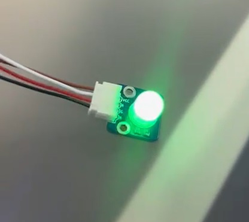

En la imagen se puede observar el cableado físico del proyecto, incluyendo la protoboard y el Arduino. También se aprecia la conexión de los sensores, mostrando cómo están integrados en el sistema.

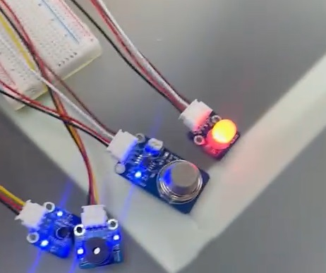

En esta imagen se puede observar que tanto el nivel de gas como la temperatura han superado los límites establecidos. Como consecuencia, el LED indicador se ilumina en rojo y la alarma se activa, alertando sobre una posible situación de riesgo.

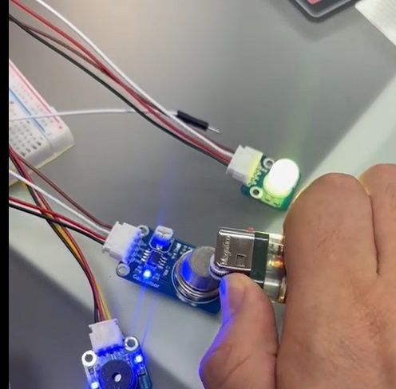

En esta imagen se puede observar que tanto el nivel de gas como el de temperatura se encuentran dentro de los límites seguros, es decir, por debajo del umbral de 400 y de 30°C. Como resultado, la alarma no se activa y el LED indicador permanece en color verde, señalando un estado normal y sin riesgos

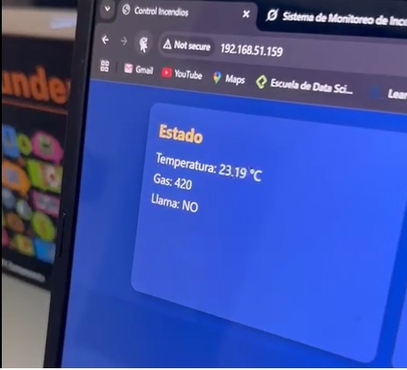

En la imagen se muestra la prueba del sensor de llama, donde al acercar un encendedor encendido, el sistema detecta la presencia de fuego. Como resultado, se activa una alarma y en la pantalla LCD aparece el mensaje "ALERTA: FUEGO"


En la imagen se muestra la prueba del sensor de llama, donde al acercar un encendedor encendido, el sistema detecta la presencia de fuego. Como resultado, se activa una alarma y en la pantalla LCD aparece el mensaje "ALERTA: FUEGO"


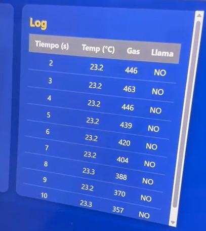

En la imagen se muestra la prueba del sensor de llama, donde al acercar un encendedor encendido, el sistema detecta la presencia de fuego. Como resultado, se activa una alarma y en la pantalla LCD aparece el mensaje "ALERTA: FUEGO"

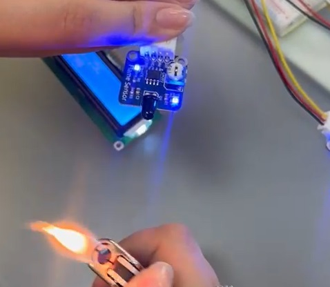

En la imagen se muestra la prueba del sensor de llama, donde al acercar un encendedor encendido, el sistema detecta la presencia de fuego. Como resultado, se activa una alarma y en la pantalla LCD aparece el mensaje "ALERTA: FUEGO"

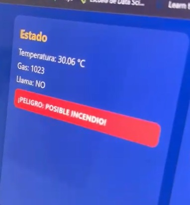

En la imagen se muestra la prueba del sensor de llama, donde al acercar un encendedor encendido, el sistema detecta la presencia de fuego. Como resultado, se activa una alarma y en la pantalla LCD aparece el mensaje "ALERTA: FUEGO"


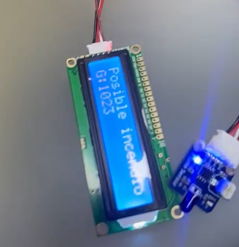

En la imagen se muestra la prueba del sensor de llama, donde al acercar un encendedor encendido, el sistema detecta la presencia de fuego. Como resultado, se activa una alarma y en la pantalla LCD aparece el mensaje "ALERTA: FUEGO"


## **7. Referencias**
 1:  E. R. Moraguez, "Ventajas y Desventajas ESP32 en IoT y Desarrollo," LovTechnology, 9 meses atrás. [En línea]. Disponible en: https://lovtechnology.com/ventajas-y-desventajas-esp32-en-iot-y-desarrollo/ (Accedido: 22-mar-2025)​
  2: Robotlandia, "Módulo KY-028 Sensor de Temperatura Digital", https://robotlandia.es/temperatura-y-humedad/681-modulo-ky-028-sensor-de-temperatura-digital.html (accedido: 16 de febrero de 2025).

 3: Julpin, "Módulo Sensor Analógico de Gas MQ-2 para Arduino", https://www.julpin.com.co/inicio/modulos-sensores/492-modulo-sensor-analogico-de-gas-mq-2-para-arduino.html (accedido: 16 de febrero de 2025).

 4: D Bots, "KY-026 Módulo Sensor de Llama", https://3dbots.co/producto/ky-026-modulo-sensor-de-llama/ (accedido: 16 de febrero de 2025).

 5: "Las fases de un incendio," Crónica Seguridad, 9 de julio de 2024. [En línea]. Disponible en: https://cronicaseguridad.com/2024/07/09/las-fases-de-un-incendio/. (Accedido: 22 de marzo de 2025)

 6: A. Jain, "Threads and how to create it in C++," Medium, 6 de septiembre de 2024. [En línea]. Disponible: https://medium.com/@abhishekjainindore24/threads-and-how-to-create-it-in-c-cb5583939686​

 7: IEEE Standards Association, "The Evolution of Wi-Fi Technology and Standards," 16 de mayo de 2023. [En línea]. Disponible: https://standards.ieee.org/beyond-standards/the-evolution-of-wi-fi-technology-and-standards/

 8: "¿Cuáles son sus estándares de diseño de ingeniería?", LinkedIn, 2023. [En línea]. Disponible: https://es.linkedin.com/advice/0/what-your-engineering-design-standards-skills-engineering-design?lang=es. [Accedido: 23-mar-2025].​

 9: INCOSE, "SE Standards," 2023. [En línea]. Disponible: https://www.incose.org/about-systems-engineering/se-standards. [Accedido: 23-mar-2025].
